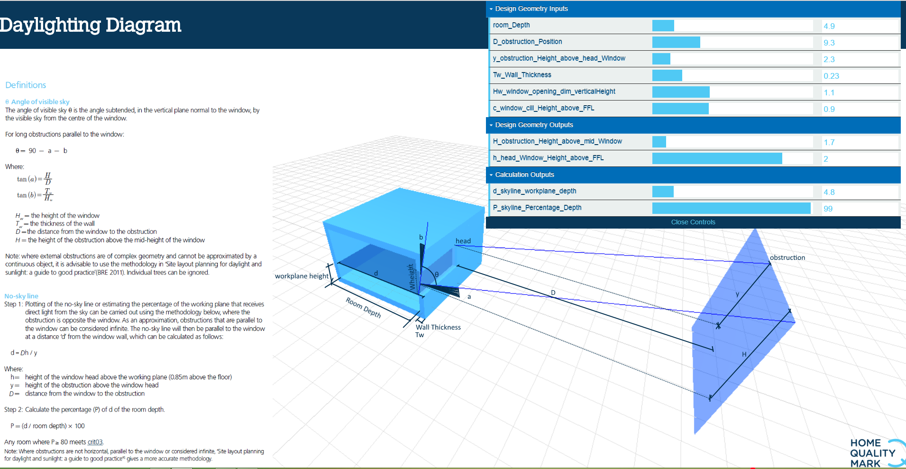

# Daylighting View of Sky

The [`html file`](https://github.com/JulesBuh/threeD.js/blob/master/indexLight.html) located in this repository is an experimental visualisation of the `View of Sky` equations written in [`BREEAM`](https://www.breeam.com/projects/)[`HQM Daylighting Issue`](http://www.homequalitymark.com/standard).

 
